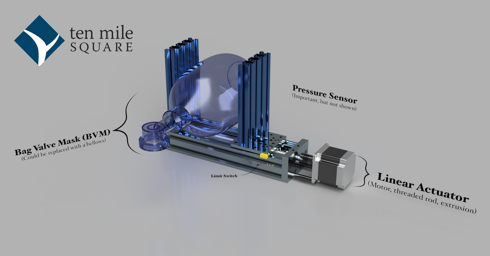

# g2core Pressurizer
A prototype emergency ventilator project based on [g2core](https://github.com/synthetos/g2/tree/pressurizer)

# What is this?

See the blog posts [Designing an Intelligent IoT Ventilator From Home, Pt. 1](https://tenmilesquare.com/designing-an-intelligent-iot-ventilator-from-home-pt-1/) for an introduction and **Designing an Intelligent IoT Ventilator From Home, Pt. 2** for more detailed theory of operation.
  
# State of the project

- [x] Build proof-of-concept (POC) firmaware and hardware solution and verify minimal functionality [video here](https://youtu.be/bmQI65D5-_8)
- [X] Document theory of operation located in the **second blog post here**
- [X] [Document Bill-of-materials (BOM) for POC with links for ordering](Bill-of-Materials.md)
- [ ] Document firmware build process
- [ ] Document hardware build process
- [ ] Build and test physical UI firmware
- [ ] Build remote IoT control capability
  - [ ] GrapQL / MQTT Service
  - [ ] Web UI
