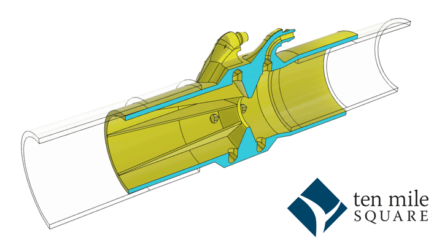

# g2Core Pressurizer Flow Sensor

This project [described in this blog post](https://tenmilesquare.com/designing-and-building-a-ventilator-flow-sensor-from-home-pt-3/) provides a flow sensor that may be used completely independently of the Pressurizer.

# Downloads

| Version | Links |
| ----: | --- |
| v32.2 | [STL](./flow-sensor-v32.2.stl) - Fusion360 (soon) |

# Instructions

## Printable version

Tested by printing with PETG, but PLA should work as well. Print oriented on it's end with the ports poiinting **up**. This will leave little contact with the bed, so you'll need to make sure your bed is clean and prepared properly for your type of printer and meaterial. On the Prusa MK3s, that means cleaned with dish soap thoroughly (every 4-5 prints) and then a thin layer of glue stick applied where the print will land and the bottom left corner where it primes the extruder.

### Print Settings:
- NO support (unless you have disolvable support)
- 0.15mm layer height or less (thinner layers are better)
- 15% infill (can be adjusted, not much infill on this one)
- Designed for a 0.4mm nozzle, so that most of the walls are exactly three perimeters width. The wall thickness is a parameter in Fusion360 if it needs to be adjusted

# On the way

- List of sensors that are usable
- Python code to run on a Raspberry Pi to test (for I2C sensors only, for now)
- Assembly instructions
