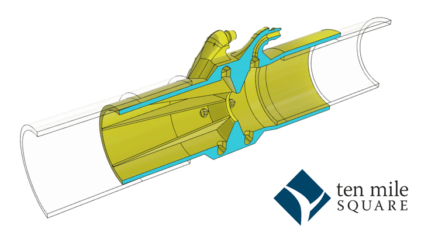

# g2Core Pressurizer Flow Sensor

This project [described in this blog post](https://tenmilesquare.com/designing-and-building-a-ventilator-flow-sensor-from-home-pt-3/) provides a flow sensor that may be used completely independently of the Pressurizer.

The STL file for 3D printing is here:

| Version | Links |
| ----: | --- |
| v32.2 | [STL](./flow-sensor-v32.2.stl) - Fusion360 (soon) |
